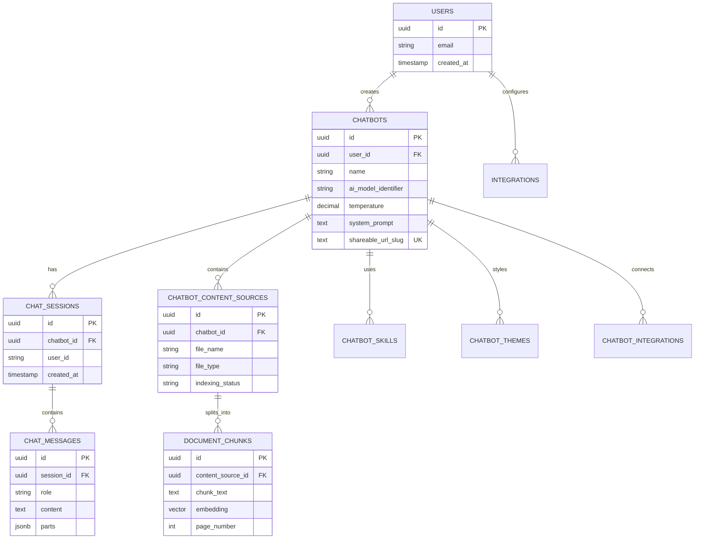

# Database Schema

Complete database schema and relationships for Syllabi.

## Overview

Syllabi uses **PostgreSQL** via Supabase with:
- Row Level Security (RLS) for multi-tenancy
- Vector similarity search (pgvector)
- Real-time subscriptions
- Built-in authentication
- File storage

## Entity Relationship Diagram



## Core Tables

### 1. users
**Managed by Supabase Auth** - No custom table needed.

Access via: `auth.users()`

Fields:
- `id` (UUID)
- `email` (text)
- `created_at` (timestamp)
- `email_confirmed_at` (timestamp)

### 2. chatbots

Stores chatbot configurations.

```sql filename="migrations/create_chatbots_table.sql"
CREATE TABLE chatbots (
  id UUID PRIMARY KEY DEFAULT uuid_generate_v4(),
  user_id UUID NOT NULL REFERENCES auth.users(id) ON DELETE CASCADE,
  name TEXT NOT NULL,
  description TEXT,

  -- AI Configuration
  ai_model_identifier TEXT DEFAULT 'gpt-4o-mini',
  temperature DECIMAL(3,2) DEFAULT 0.7,
  system_prompt TEXT,

  -- Behavior
  tool_selection_method TEXT DEFAULT 'auto',
  suggested_prompts JSONB DEFAULT '[]'::jsonb,

  -- Branding
  shareable_url_slug TEXT UNIQUE,
  logo_url TEXT,
  theme_id UUID REFERENCES chatbot_themes(id),

  -- Metadata
  created_at TIMESTAMP WITH TIME ZONE DEFAULT NOW(),
  updated_at TIMESTAMP WITH TIME ZONE DEFAULT NOW(),

  CONSTRAINT valid_temperature CHECK (temperature >= 0 AND temperature <= 2)
);

-- Indexes
CREATE INDEX idx_chatbots_user_id ON chatbots(user_id);
CREATE INDEX idx_chatbots_slug ON chatbots(shareable_url_slug);

-- RLS Policies
ALTER TABLE chatbots ENABLE ROW LEVEL SECURITY;

CREATE POLICY "Users can view their own chatbots"
  ON chatbots FOR SELECT
  USING (auth.uid() = user_id);

CREATE POLICY "Users can create chatbots"
  ON chatbots FOR INSERT
  WITH CHECK (auth.uid() = user_id);

CREATE POLICY "Users can update their chatbots"
  ON chatbots FOR UPDATE
  USING (auth.uid() = user_id);

CREATE POLICY "Users can delete their chatbots"
  ON chatbots FOR DELETE
  USING (auth.uid() = user_id);
```

### 3. chat_sessions

Individual conversations with a chatbot.

```sql
CREATE TABLE chat_sessions (
  id UUID PRIMARY KEY DEFAULT uuid_generate_v4(),
  chatbot_id UUID NOT NULL REFERENCES chatbots(id) ON DELETE CASCADE,
  user_id UUID REFERENCES auth.users(id) ON DELETE SET NULL,

  -- Session Info
  title TEXT,
  source TEXT DEFAULT 'web', -- 'web', 'discord', 'slack', 'embed'

  -- Metadata
  metadata JSONB DEFAULT '{}'::jsonb,
  created_at TIMESTAMP WITH TIME ZONE DEFAULT NOW(),
  updated_at TIMESTAMP WITH TIME ZONE DEFAULT NOW()
);

-- Indexes
CREATE INDEX idx_sessions_chatbot ON chat_sessions(chatbot_id);
CREATE INDEX idx_sessions_user ON chat_sessions(user_id);
CREATE INDEX idx_sessions_created ON chat_sessions(created_at DESC);

-- RLS
ALTER TABLE chat_sessions ENABLE ROW LEVEL SECURITY;

CREATE POLICY "Users can view their own sessions"
  ON chat_sessions FOR SELECT
  USING (
    auth.uid() = user_id OR
    chatbot_id IN (SELECT id FROM chatbots WHERE user_id = auth.uid())
  );
```

### 4. chat_messages

Individual messages in a conversation.

```sql
CREATE TABLE chat_messages (
  id UUID PRIMARY KEY DEFAULT uuid_generate_v4(),
  session_id UUID NOT NULL REFERENCES chat_sessions(id) ON DELETE CASCADE,
  chatbot_id UUID NOT NULL REFERENCES chatbots(id) ON DELETE CASCADE,

  -- Message Content
  role TEXT NOT NULL CHECK (role IN ('user', 'assistant', 'system')),
  content TEXT NOT NULL,
  parts JSONB DEFAULT '[]'::jsonb, -- AI SDK v5 message parts

  -- Metadata
  metadata JSONB DEFAULT '{}'::jsonb,
  token_count INTEGER DEFAULT 0,
  created_at TIMESTAMP WITH TIME ZONE DEFAULT NOW()
);

-- Indexes
CREATE INDEX idx_messages_session ON chat_messages(session_id);
CREATE INDEX idx_messages_chatbot ON chat_messages(chatbot_id);
CREATE INDEX idx_messages_created ON chat_messages(created_at);

-- RLS
ALTER TABLE chat_messages ENABLE ROW LEVEL SECURITY;

CREATE POLICY "Users can view messages in their sessions"
  ON chat_messages FOR SELECT
  USING (
    session_id IN (
      SELECT id FROM chat_sessions
      WHERE user_id = auth.uid() OR
      chatbot_id IN (SELECT id FROM chatbots WHERE user_id = auth.uid())
    )
  );
```

### 5. chatbot_content_sources

Uploaded documents, URLs, videos, etc.

```sql
CREATE TABLE chatbot_content_sources (
  id UUID PRIMARY KEY DEFAULT uuid_generate_v4(),
  chatbot_id UUID NOT NULL REFERENCES chatbots(id) ON DELETE CASCADE,
  folder_id UUID REFERENCES content_folders(id) ON DELETE SET NULL,

  -- File Info
  file_name TEXT,
  file_type TEXT, -- 'document', 'url', 'video', 'audio'
  file_url TEXT,
  file_size BIGINT,

  -- Processing Status
  indexing_status TEXT DEFAULT 'pending',
  -- 'pending', 'processing', 'completed', 'failed'
  indexing_error TEXT,

  -- Metadata
  metadata JSONB DEFAULT '{}'::jsonb,
  uploaded_at TIMESTAMP WITH TIME ZONE DEFAULT NOW(),
  indexed_at TIMESTAMP WITH TIME ZONE
);

-- Indexes
CREATE INDEX idx_content_chatbot ON chatbot_content_sources(chatbot_id);
CREATE INDEX idx_content_status ON chatbot_content_sources(indexing_status);
CREATE INDEX idx_content_folder ON chatbot_content_sources(folder_id);

-- RLS
ALTER TABLE chatbot_content_sources ENABLE ROW LEVEL SECURITY;

CREATE POLICY "Users can manage content in their chatbots"
  ON chatbot_content_sources FOR ALL
  USING (chatbot_id IN (SELECT id FROM chatbots WHERE user_id = auth.uid()));
```

### 6. document_chunks

Vectorized text chunks for RAG.

```sql
CREATE TABLE document_chunks (
  id UUID PRIMARY KEY DEFAULT uuid_generate_v4(),
  chatbot_id UUID NOT NULL REFERENCES chatbots(id) ON DELETE CASCADE,
  reference_id UUID REFERENCES chatbot_content_sources(id) ON DELETE CASCADE,

  -- Content
  chunk_text TEXT NOT NULL,
  chunk_type TEXT DEFAULT 'text', -- 'text', 'transcript'
  page_number INTEGER,

  -- Vector Embedding
  embedding VECTOR(1536), -- OpenAI text-embedding-3-small dimension

  -- Multimedia Support
  start_time_seconds DECIMAL,
  end_time_seconds DECIMAL,
  speaker TEXT,

  -- Metadata
  token_count INTEGER,
  metadata JSONB DEFAULT '{}'::jsonb,
  created_at TIMESTAMP WITH TIME ZONE DEFAULT NOW()
);

-- Indexes
CREATE INDEX idx_chunks_chatbot ON document_chunks(chatbot_id);
CREATE INDEX idx_chunks_reference ON document_chunks(reference_id);

-- Vector similarity search index
CREATE INDEX idx_chunks_embedding ON document_chunks
USING ivfflat (embedding vector_cosine_ops)
WITH (lists = 100);

-- RLS
ALTER TABLE document_chunks ENABLE ROW LEVEL SECURITY;

CREATE POLICY "Users can query chunks from their chatbots"
  ON document_chunks FOR SELECT
  USING (chatbot_id IN (SELECT id FROM chatbots WHERE user_id = auth.uid()));
```

### 7. chatbot_skills

Custom actions/tools for chatbots.

```sql
CREATE TABLE chatbot_skills (
  id UUID PRIMARY KEY DEFAULT uuid_generate_v4(),
  chatbot_id UUID NOT NULL REFERENCES chatbots(id) ON DELETE CASCADE,
  skill_id UUID REFERENCES builtin_skills(id),

  -- Skill Configuration
  name TEXT NOT NULL,
  description TEXT,
  input_schema JSONB NOT NULL, -- Zod schema as JSON
  execution_config JSONB NOT NULL,

  -- Status
  is_enabled BOOLEAN DEFAULT true,

  -- Metadata
  created_at TIMESTAMP WITH TIME ZONE DEFAULT NOW(),
  updated_at TIMESTAMP WITH TIME ZONE DEFAULT NOW()
);

-- Indexes
CREATE INDEX idx_skills_chatbot ON chatbot_skills(chatbot_id);
CREATE INDEX idx_skills_enabled ON chatbot_skills(is_enabled);

-- RLS
ALTER TABLE chatbot_skills ENABLE ROW LEVEL SECURITY;

CREATE POLICY "Users can manage skills in their chatbots"
  ON chatbot_skills FOR ALL
  USING (chatbot_id IN (SELECT id FROM chatbots WHERE user_id = auth.uid()));
```

### 8. chatbot_themes

Custom appearance themes.

```sql
CREATE TABLE chatbot_themes (
  id UUID PRIMARY KEY DEFAULT uuid_generate_v4(),
  user_id UUID NOT NULL REFERENCES auth.users(id) ON DELETE CASCADE,
  name TEXT NOT NULL,

  -- Theme Configuration
  primary_color TEXT DEFAULT '#007bff',
  background_color TEXT DEFAULT '#ffffff',
  user_bubble_bg_color TEXT DEFAULT '#007bff',
  user_bubble_text_color TEXT DEFAULT '#ffffff',
  bot_bubble_text_color TEXT DEFAULT '#000000',
  font_family TEXT DEFAULT 'Inter',

  -- Additional Styles
  custom_css TEXT,

  -- Metadata
  is_default BOOLEAN DEFAULT false,
  created_at TIMESTAMP WITH TIME ZONE DEFAULT NOW(),
  updated_at TIMESTAMP WITH TIME ZONE DEFAULT NOW()
);

-- RLS
ALTER TABLE chatbot_themes ENABLE ROW LEVEL SECURITY;

CREATE POLICY "Users can manage their themes"
  ON chatbot_themes FOR ALL
  USING (auth.uid() = user_id);
```

### 9. integrations

User-level integrations (Discord, Slack, etc.).

```sql
CREATE TABLE integrations (
  id UUID PRIMARY KEY DEFAULT uuid_generate_v4(),
  user_id UUID NOT NULL REFERENCES auth.users(id) ON DELETE CASCADE,

  -- Integration Type
  integration_type TEXT NOT NULL, -- 'discord', 'slack', 'google', 'notion'
  integration_name TEXT NOT NULL,

  -- OAuth Tokens
  access_token TEXT,
  refresh_token TEXT,
  token_expires_at TIMESTAMP WITH TIME ZONE,

  -- Integration-specific Config
  config JSONB DEFAULT '{}'::jsonb,

  -- Status
  is_active BOOLEAN DEFAULT true,

  -- Metadata
  created_at TIMESTAMP WITH TIME ZONE DEFAULT NOW(),
  updated_at TIMESTAMP WITH TIME ZONE DEFAULT NOW()
);

-- Indexes
CREATE INDEX idx_integrations_user ON integrations(user_id);
CREATE INDEX idx_integrations_type ON integrations(integration_type);

-- RLS
ALTER TABLE integrations ENABLE ROW LEVEL SECURITY;

CREATE POLICY "Users can manage their integrations"
  ON integrations FOR ALL
  USING (auth.uid() = user_id);
```

### 10. chatbot_integrations

Link chatbots to user integrations.

```sql
CREATE TABLE chatbot_integrations (
  id UUID PRIMARY KEY DEFAULT uuid_generate_v4(),
  chatbot_id UUID NOT NULL REFERENCES chatbots(id) ON DELETE CASCADE,
  integration_id UUID NOT NULL REFERENCES integrations(id) ON DELETE CASCADE,

  -- Channel/Server specific config
  channel_config JSONB DEFAULT '{}'::jsonb,

  -- Status
  is_active BOOLEAN DEFAULT true,

  created_at TIMESTAMP WITH TIME ZONE DEFAULT NOW(),

  UNIQUE(chatbot_id, integration_id)
);

-- RLS
ALTER TABLE chatbot_integrations ENABLE ROW LEVEL SECURITY;

CREATE POLICY "Users can manage chatbot integrations"
  ON chatbot_integrations FOR ALL
  USING (
    chatbot_id IN (SELECT id FROM chatbots WHERE user_id = auth.uid())
  );
```

## Helper Functions

### Vector Similarity Search

```sql
CREATE OR REPLACE FUNCTION match_document_chunks(
  query_embedding VECTOR(1536),
  chatbot_id_param UUID,
  match_threshold FLOAT DEFAULT 0.7,
  match_count INT DEFAULT 10
)
RETURNS TABLE (
  chunk_id UUID,
  chunk_text TEXT,
  page_number INTEGER,
  similarity FLOAT,
  reference_id UUID,
  file_name TEXT
)
LANGUAGE plpgsql
AS $$
BEGIN
  RETURN QUERY
  SELECT
    dc.id AS chunk_id,
    dc.chunk_text,
    dc.page_number,
    1 - (dc.embedding <=> query_embedding) AS similarity,
    dc.reference_id,
    cs.file_name
  FROM document_chunks dc
  LEFT JOIN chatbot_content_sources cs ON dc.reference_id = cs.id
  WHERE
    dc.chatbot_id = chatbot_id_param
    AND 1 - (dc.embedding <=> query_embedding) > match_threshold
  ORDER BY dc.embedding <=> query_embedding
  LIMIT match_count;
END;
$$;
```

### Multimedia Chunks with Time Range

```sql
CREATE OR REPLACE FUNCTION match_multimedia_chunks_with_time(
  query_embedding VECTOR(1536),
  chatbot_id_param UUID,
  reference_id_param UUID DEFAULT NULL,
  match_threshold FLOAT DEFAULT 0.7,
  match_count INT DEFAULT 8,
  time_range_start DECIMAL DEFAULT NULL,
  time_range_end DECIMAL DEFAULT NULL
)
RETURNS TABLE (
  chunk_id UUID,
  chunk_text TEXT,
  start_time_seconds DECIMAL,
  end_time_seconds DECIMAL,
  similarity FLOAT
)
LANGUAGE plpgsql
AS $$
BEGIN
  RETURN QUERY
  SELECT
    dc.id AS chunk_id,
    dc.chunk_text,
    dc.start_time_seconds,
    dc.end_time_seconds,
    1 - (dc.embedding <=> query_embedding) AS similarity
  FROM document_chunks dc
  WHERE
    dc.chatbot_id = chatbot_id_param
    AND dc.chunk_type = 'transcript'
    AND (reference_id_param IS NULL OR dc.reference_id = reference_id_param)
    AND (time_range_start IS NULL OR dc.start_time_seconds >= time_range_start)
    AND (time_range_end IS NULL OR dc.end_time_seconds <= time_range_end)
    AND 1 - (dc.embedding <=> query_embedding) > match_threshold
  ORDER BY dc.embedding <=> query_embedding
  LIMIT match_count;
END;
$$;
```

## Indexes Summary

### Performance Indexes
- All foreign keys have indexes
- `created_at` fields for time-based queries
- Composite indexes for common query patterns

### Vector Indexes
- `ivfflat` index on embeddings for fast similarity search
- Approximate nearest neighbor (ANN) search
- Trade-off between speed and accuracy

## Data Types

### JSONB Fields

**chatbots.metadata**:
```json
{
  "model": {
    "provider": "openai",
    "model": "gpt-4o-mini",
    "temperature": 0.7
  },
  "response": {
    "finishReason": "stop",
    "timestamp": "2024-01-01T00:00:00Z"
  }
}
```

**chat_messages.parts** (AI SDK v5 format):
```json
[
  {
    "type": "text",
    "text": "Hello!",
    "state": "done"
  },
  {
    "type": "tool-call",
    "toolCallId": "call_123",
    "toolName": "getRelevantDocuments",
    "input": { "query": "test" }
  },
  {
    "type": "tool-result",
    "toolCallId": "call_123",
    "result": { "documents": [...] }
  }
]
```

## Storage Buckets

### chat-files
- User uploaded files
- PDFs, images, audio, video
- Public read access
- Authenticated write

### chatbot-assets
- Logos, icons
- Theme images
- Public read access
- Authenticated write

## Migrations

Located in `frontend/supabase/migrations/`:

1. `20240101_create_chatbots.sql`
2. `20240102_create_sessions.sql`
3. `20240103_create_messages.sql`
4. `20240104_create_content_sources.sql`
5. `20240105_create_document_chunks.sql`
6. `20240106_enable_vector_extension.sql`
7. `20240107_create_skills.sql`
8. `20240108_create_themes.sql`
9. `20240109_create_integrations.sql`
10. `20240110_enable_rls.sql`

## Best Practices

### 1. Always Use RLS
- Protects against unauthorized access
- Enforced at database level
- Works with direct database access

### 2. Index Wisely
- Index foreign keys
- Index frequently filtered columns
- Don't over-index (slows writes)

### 3. Use JSONB for Flexibility
- Metadata fields
- Configuration objects
- Dynamic schemas

### 4. Vector Search Tuning
- Adjust `match_threshold` based on use case
- Higher threshold = more precise, fewer results
- Lower threshold = more results, less precise

## Next Steps

- [Contributing Guide](/docs/development/contributing)
- [Frontend Architecture](/docs/development/frontend-architecture)
- [Backend Architecture](/docs/development/backend-architecture)
