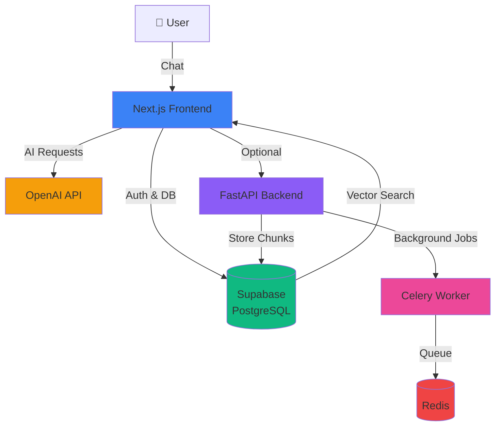

# Getting Started with Syllabi

Welcome to Syllabi! This guide will help you get started with setting up and deploying your own AI-powered chatbot platform.

## What is Syllabi?

Syllabi is an open-source AI chatbot platform that allows you to:

- 🤖 Build intelligent chatbots powered by OpenAI GPT-4 and other LLMs
- 📚 Create knowledge bases from documents, PDFs, videos, and audio
- 🎨 Customize chatbot appearance with themes
- 🔌 Integrate with Discord, Slack, Teams, and more
- ⚡ Extend functionality with custom Skills/Actions
- 📊 Track usage with built-in analytics
- 🌐 Embed chatbots on any website

## Architecture Overview

Syllabi consists of two main components:

### Frontend (Required)
- **Next.js 15** application with App Router
- **Vercel AI SDK v5** for streaming chat responses
- **Supabase** for database and authentication
- **TailwindCSS** for styling

### Backend (Required for Document Processing)
- **FastAPI** Python service for document processing
- **Celery** for background tasks
- **Redis** for task queue
- **Required for**: Processing all documents (PDFs, videos, audio files, text extraction)

import { Callout } from 'nextra/components'

<Callout type="warning">
The backend is required for any document processing functionality. The frontend alone can only handle chat interactions with pre-processed knowledge bases.
</Callout>

## Quick Start Paths

Choose the path that fits your needs:

### 🚀 Quick Deploy (Recommended for Beginners)
Deploy to Vercel in minutes with just the frontend.
- [Quick Deployment Guide](/docs/getting-started/quick-deployment)

### 💻 Local Development
Set up the full development environment locally.
- [Local Setup Guide](/docs/getting-started/local-setup)

### 🐳 Docker Deploy
Run the entire stack with Docker Compose.
- [Docker Deployment](/docs/deployment/docker-compose)

## Prerequisites

Before you begin, ensure you have:

- Node.js 20+ and npm
- A Supabase account (free tier works great!)
- An OpenAI API key
- Git installed

See the [detailed prerequisites](/docs/getting-started/prerequisites) for more information.

## Next Steps

1. Review the [Prerequisites](/docs/getting-started/prerequisites)
2. Follow the [Local Setup](/docs/getting-started/local-setup) guide
3. Or jump straight to [Quick Deployment](/docs/getting-started/quick-deployment)

## Need Help?

- 📖 Check the [Troubleshooting](/docs/troubleshooting) guide
- 💬 Join our [Discord community](#)
- 🐛 Report bugs on [GitHub Issues](https://github.com/YOUR_USERNAME/syllabi/issues)