# Uploading Documents

Learn how to upload and manage documents for your chatbot's knowledge base.

## Overview

Documents provide your chatbot with knowledge to answer questions. Syllabi currently supports:

- 📄 **PDF files** - Manuals, guides, reports
- 📄 **Text files** - .txt, .md
- 📊 **CSV files** - Structured data
- 🎥 **Video files** - Upload MP4, AVI, MOV files directly
- 🎵 **Audio files** - Upload MP3, WAV files directly
- 🌐 **Web pages** - Import via URL

import { Callout } from 'nextra/components'

<Callout type="info">
**Coming Soon**: Direct Word document (.docx) upload and YouTube URL import are planned for future releases. For now, convert Word documents to PDF and download videos before uploading.
</Callout>

## Document Processing Pipeline

```mermaid
graph LR
    A[📁 Upload<br/>File] -->|Store| B[☁️ Supabase<br/>Storage]
    B -->|Extract| C[📝 Parse<br/>Text]
    C -->|Split| D[✂️ Chunk<br/>512-1024 tokens]
    D -->|Generate| E[🔢 Embed<br/>OpenAI]
    E -->|Save| F[(💾 PostgreSQL<br/>+pgvector)]
    F -->|Query| G[✅ Ready<br/>for Chat]

    style A fill:#3b82f6
    style C fill:#8b5cf6
    style D fill:#ec4899
    style E fill:#f59e0b
    style F fill:#10b981
    style G fill:#22c55e
```



1. **Upload**: File uploaded to storage
2. **Parse**: Extract text content
3. **Chunk**: Split into manageable pieces (512-1024 tokens)
4. **Embed**: Generate vector embeddings for similarity search
5. **Store**: Save chunks and embeddings in database
6. **Ready**: Available for chatbot to reference

## Uploading PDF Documents

### Step-by-Step

1. Go to your chatbot dashboard
2. Click **Content** tab
3. Click **Upload Document** button
4. Select **PDF** from file type dropdown
5. Choose your PDF file (max 50MB)
6. Click **Upload**
7. Wait for processing (30 seconds - 5 minutes depending on size)

### Best Practices

**File preparation**:
- ✅ Use searchable PDFs (not scanned images without OCR)
- ✅ Remove password protection
- ✅ Check for proper text extraction:
  - Copy/paste text from PDF
  - If you can't select text, it's an image-based PDF
- ✅ Optimize file size (< 20MB recommended)

**Content guidelines**:
- ✅ Well-structured with headings
- ✅ Clear, readable font
- ✅ Good formatting (tables, lists)
- ✅ Relevant to chatbot purpose

**What to avoid**:
- ❌ Scanned documents without text layer
- ❌ Password-protected PDFs
- ❌ Corrupted files
- ❌ PDFs with mostly images
- ❌ Files > 50MB

### Example Use Cases

**Product Manual**:
```
Product-Manual-v2.pdf
├── 234 pages
├── Processing time: ~2 minutes
├── Generates: ~400 chunks
└── Chatbot can answer: Installation, troubleshooting, specifications
```

**Company Handbook**:
```
Employee-Handbook-2024.pdf
├── 87 pages
├── Processing time: ~45 seconds
├── Generates: ~150 chunks
└── Chatbot can answer: Policies, benefits, procedures
```

## Uploading Word Documents

<Callout type="warning">
**Word documents (.docx, .doc) are not directly supported yet.** To use Word documents, convert them to PDF first.
</Callout>

### Converting Word to PDF

**Option 1: Using Microsoft Word**
1. Open your document in Word
2. File → Save As
3. Choose **PDF** from format dropdown
4. Save and upload the PDF

**Option 2: Online Converters**
- [pdf.io](https://pdf.io/word-to-pdf/)
- [Smallpdf](https://smallpdf.com/word-to-pdf)
- [CloudConvert](https://cloudconvert.com/docx-to-pdf)

### Why Convert?
- ✅ Better text extraction from PDF
- ✅ Preserves formatting
- ✅ Ensures compatibility
- ✅ Works immediately without waiting for feature release

## Uploading Text Files

### Supported Formats

- `.txt` - Plain text
- `.md` - Markdown
- `.csv` - Comma-separated values

### Markdown Files

Great for documentation:

**Example**:
```markdown
# API Reference

## Authentication

All requests require an API key in the header:

`Authorization: Bearer YOUR_API_KEY`

## Endpoints

### GET /api/users

Returns list of users.

**Parameters**:
- `page`: Page number (default: 1)
- `limit`: Results per page (default: 10)

**Response**:
```json
{
  "users": [...],
  "total": 100
}
```
```

Upload process:
1. Save as `api-reference.md`
2. Upload via Content tab
3. Chatbot understands structure and formatting

### CSV Files

Upload structured data:

**Example** - Product Catalog:
```csv
product_id,name,price,category,description
001,Widget Pro,29.99,Hardware,Professional-grade widget
002,Widget Lite,19.99,Hardware,Budget-friendly widget
003,Widget Plus,39.99,Hardware,Premium widget with extras
```

Chatbot can answer:
- "What's the price of Widget Pro?" → "$29.99"
- "Show me hardware products" → Lists all hardware items
- "Compare Widget Pro and Widget Plus" → Provides comparison

## Uploading Videos

<Callout type="warning">
**YouTube URL import is not yet supported.** To use videos, download them first and upload the video file directly.
</Callout>

### Supported Video Formats

- `.mp4` - MPEG-4 video
- `.avi` - Audio Video Interleave
- `.mov` - QuickTime movie
- `.mkv` - Matroska video

### Upload Process

1. **Download your video** (from YouTube, Vimeo, etc.)
   - Use tools like: [4K Video Downloader](https://www.4kdownload.com/), [yt-dlp](https://github.com/yt-dlp/yt-dlp)
2. **Content** tab → **Upload Document**
3. Select **Video** from file type dropdown
4. Choose your video file (max 200MB recommended)
5. Click **Upload**
6. Wait for transcription and processing

### Processing

1. **Extract audio**: Audio track extracted from video
2. **Transcribe**: Speech-to-text using Whisper API
3. **Chunk by timestamps**: Each chunk includes time range
4. **Generate embeddings**: Search by content and timestamp

### Chatbot Capabilities

Users can ask:
- "What does the video say about X?"
- "Summarize the video"
- "At what timestamp is Y discussed?"
- "What topics are covered?"

### Tips

- ✅ Clear audio quality improves transcription accuracy
- ✅ Minimal background noise
- ✅ Keep file sizes reasonable (< 200MB)
- ✅ Use common formats (MP4 recommended)

<Callout type="info">
**Coming Soon**: Direct YouTube URL import will be added in a future release, eliminating the need to download videos manually.
</Callout>

## Uploading Audio Files

### Supported Formats

- `.mp3` - MPEG audio
- `.wav` - Waveform audio
- `.m4a` - MPEG-4 audio
- `.ogg` - Ogg Vorbis

### Transcription Process

1. Upload audio file (max 200MB)
2. File sent to transcription service (Whisper API)
3. Speech-to-text conversion
4. Transcript chunked and embedded
5. Ready for queries

### Requirements

- ✅ Clear audio quality
- ✅ Minimal background noise
- ✅ Backend service running for transcription

### Use Cases

**Podcast Episodes**:
```
episode-042.mp3
├── Duration: 45 minutes
├── Transcription time: ~5 minutes
├── Chatbot can answer episode content questions
```

**Meeting Recordings**:
```
team-meeting-2024-01-15.m4a
├── Duration: 30 minutes
├── Chatbot can summarize decisions and action items
```

**Lecture Recordings**:
```
calculus-lecture-3.mp3
├── Duration: 60 minutes
├── Students can ask questions about lecture content
```

## Uploading Web Pages

### URL Import

1. **Content** tab → **Add URL**
2. Select **Web Page**
3. Enter URL:
   ```
   https://example.com/docs/getting-started
   ```
4. Click **Import**

### What Gets Extracted

- ✅ Main content text
- ✅ Headings and structure
- ✅ Lists and tables
- ✅ Article metadata
- ❌ Navigation menus
- ❌ Ads and sidebars
- ❌ Comments

### Bulk Import

Import entire documentation sites:

**Example** - Import all docs pages:
```
https://example.com/docs/intro
https://example.com/docs/installation
https://example.com/docs/configuration
https://example.com/docs/api
```

Or use sitemap import (if supported):
```
https://example.com/sitemap.xml
```

### Tips

- ✅ Import clean, well-structured pages
- ✅ Verify content was extracted correctly
- ✅ Remove duplicate imports
- ❌ Avoid pages with heavy JavaScript rendering
- ❌ Avoid pages behind login walls

## Managing Documents

### View Uploaded Documents

**Content** tab shows all documents:

| Document | Type | Status | Size | Chunks | Actions |
|----------|------|--------|------|--------|---------|
| Product Manual | PDF | Completed | 5.2 MB | 387 | View, Delete |
| API Docs | URL | Processing | - | - | Cancel |
| Employee Handbook | DOCX | Failed | 2.1 MB | - | Retry, Delete |

### Document Status

**Pending**:
- ⏳ In upload queue
- Action: Wait

**Processing**:
- ⚙️ Currently being processed
- Action: Wait or cancel

**Completed**:
- ✅ Ready to use
- Action: View chunks, delete if needed

**Failed**:
- ❌ Processing error
- Action: Check error message, retry, or delete

### Viewing Chunks

Click **View Chunks** to see how document was split:

```
Chunk 1 (page 5):
"Getting Started with Product X

Installation requires the following prerequisites:
- Node.js 18 or higher
- npm 9 or higher..."

Chunk 2 (page 5-6):
"To install Product X, run the following command:

npm install product-x

This will download and install all required dependencies..."
```

### Deleting Documents

1. Click **Delete** icon
2. Confirm deletion
3. Document and all chunks removed
4. Embeddings deleted
5. Chatbot will no longer reference this document

**Note**: Deletion is permanent and cannot be undone.

### Organizing with Folders

Create folders to organize documents:

```
Product Documentation/
├── User Guide.pdf
├── Installation Guide.pdf
└── Troubleshooting.pdf

Internal/
├── Employee Handbook.docx
├── HR Policies.pdf
└── IT Guidelines.pdf

Training/
├── Onboarding Video (YouTube)
├── Product Demo (YouTube)
└── Training Manual.pdf
```

**Benefits**:
- Better organization
- Easier to find documents
- Can enable/disable entire folders
- Separate concerns

## Document Processing Options

### Chunking Strategy

Configure how documents are split:

**Small Chunks (256-512 tokens)**:
- ✅ Precise retrieval
- ✅ Better for Q&A
- ❌ May lose context
- Use for: FAQs, structured data

**Medium Chunks (512-1024 tokens)** [Default]:
- ✅ Balanced
- ✅ Good context retention
- ✅ Works for most use cases

**Large Chunks (1024-2048 tokens)**:
- ✅ More context
- ✅ Better for narratives
- ❌ Less precise retrieval
- Use for: Stories, articles, long-form content

### Overlap

Add overlap between chunks:

```
Overlap: 50 tokens

Chunk 1: [Tokens 0-512]
Chunk 2: [Tokens 462-974]  (overlaps 50 tokens with Chunk 1)
Chunk 3: [Tokens 924-1436] (overlaps 50 tokens with Chunk 2)
```

**Benefits**:
- Prevents losing context at chunk boundaries
- Improves retrieval quality
- Recommended: 10-20% overlap

### Metadata

Add custom metadata to documents:

```json
{
  "document_type": "user_guide",
  "version": "2.1",
  "department": "product",
  "last_updated": "2024-01-15",
  "tags": ["installation", "configuration"]
}
```

**Use metadata for**:
- Filtering searches
- Version control
- Access control
- Analytics

## Troubleshooting

### Upload Fails

**Error**: "File too large"
- **Solution**: Compress PDF or split into smaller files
- **Limit**: 50MB per file

**Error**: "Invalid file format"
- **Solution**: Verify file extension matches content
- **Check**: File isn't corrupted

**Error**: "Processing timeout"
- **Solution**: File too large or complex, try splitting
- **Backend may need**: More resources

### No Text Extracted from PDF

**Cause**: Image-based PDF without text layer

**Solutions**:
1. Use OCR tool to add text layer:
   - Adobe Acrobat: Tools → Recognize Text
   - Online: [ocr.space](https://ocr.space)
2. Convert to Word first, then upload
3. Re-create PDF from source document

### Chunks Look Wrong

**Issue**: Sentences cut off mid-word

**Solutions**:
- Adjust chunk size
- Increase overlap
- Improve source document formatting

**Issue**: Duplicate content in chunks

**Solutions**:
- Remove duplicate pages from source
- Adjust overlap percentage
- Filter duplicate chunks

### Chatbot Can't Find Information

**Issue**: Document uploaded but chatbot doesn't use it

**Debugging**:
1. Verify document status is "Completed"
2. Check chunks were generated (View Chunks)
3. Test direct question about document content
4. Verify embeddings were created (check database)
5. Review system prompt mentions using documents

**Solutions**:
- Re-upload document
- Adjust chunking strategy
- Make system prompt explicit about using documents
- Check document actually contains the information

## Best Practices

### Content Quality

✅ **Do**:
- Upload authoritative sources
- Keep documents up to date
- Remove outdated information
- Use consistent terminology
- Include version numbers

❌ **Don't**:
- Upload low-quality content
- Mix old and new versions
- Include confidential data
- Upload irrelevant documents

### Organization

✅ **Do**:
- Use descriptive filenames
- Organize into folders
- Tag with metadata
- Document upload dates
- Track document versions

### Performance

✅ **Do**:
- Start with essential documents (3-10)
- Add more based on gaps
- Remove unused documents
- Monitor retrieval quality
- Optimize chunk sizes

❌ **Don't**:
- Upload everything at once
- Keep duplicate documents
- Ignore processing errors
- Forget to test after uploads

### Security

✅ **Do**:
- Review documents before upload
- Remove sensitive information
- Use appropriate access controls
- Audit document usage
- Rotate credentials if exposed

❌ **Don't**:
- Upload confidential data
- Share documents publicly
- Include personal information
- Upload proprietary code without permission

## Advanced Features

### Batch Upload

Upload multiple files at once:

1. Select multiple files (Shift+Click or Ctrl+Click)
2. Upload all at once
3. Monitor processing queue
4. Review results when complete

### Scheduled Re-imports

Keep web pages up to date:

1. Set re-import schedule (daily, weekly, monthly)
2. System automatically fetches latest version
3. Updates chunks with new content
4. Notifies of significant changes

**Use for**:
- Documentation websites
- Blog posts
- Product pages
- News feeds

### Document Versioning

Track document versions:

```
Product-Manual-v1.0.pdf (2023-06-15)
Product-Manual-v2.0.pdf (2024-01-15) [Current]
```

- Keep old versions for reference
- Easy rollback if needed
- Track what changed between versions

### Access Control

Restrict document access:

**Public**: Anyone can query
**Authenticated**: Logged-in users only
**Role-based**: Specific user roles only

**Example**:
```
Employee Handbook → Authenticated only
Public FAQ → Public
Executive Reports → Admin role only
```

## Next Steps

- [Customizing Theme](/docs/user-guide/customizing-theme) - Brand your chatbot
- [Skills & Actions](/docs/user-guide/skills-actions) - Add custom functionality
- [Analytics](/docs/user-guide/analytics) - Monitor document usage
- [API Reference](/docs/api-reference/document-api) - Programmatic document management

---

Your documents are the foundation of your chatbot's knowledge. Regular maintenance and optimization ensure the best user experience.
